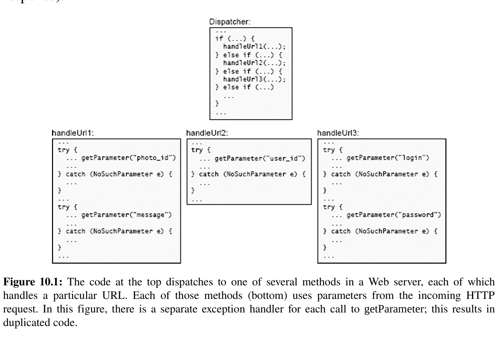

# Nature of Complexity

## Definition

> Complexity is anything related to the structure of a software system that
> makes it hard to understand and modify the system.

## Symptoms of complexity

- **Change amplification**
  > a seemingly simple change requires code modifications in many different places.
- **Cognitive load**
  > refers to how much a developer needs to know in order to complete a task.
- **Unknown unknowns**
  > it is not obvious which pieces of code must be modified to complete a task, or what information a developer must have to carry out the task successfully.

## Causes of Complexity

- **Dependencies**
- **Obscurity**

## Complexity is Incremental

# Strategic & Tactical Programming

## Tactical programming

> In the tactical approach, your main focus is to get something
> working, such as a new feature or a bug fix. At first glance this seems totally
> reasonable: what could be more important than writing code that works?
> However, tactical programming makes it nearly impossible to produce a good
> system design.

## Strategic programming

> Working code isn't enough
> Your primary goal must be to produce a great design, which also happens to work.

- Proactive Investments

  - taking extra time to find a better design rather the first one comes to mind.
  - good documentation

- Reactive Investments

      > No matter how much you invest up front,

  there will inevitably be mistakes in your design decisions.

      - Take extra time to fix design problems!!!

# Modules Should Be Deep

Modules can take many forms -> classes, subsystems, or services.

- Ideally, each module would be completely independent of the others > a developer could work in any of the modules without
  knowing anything about any of the other modules

- Reality, **modules must work together by calling each others's functions or methods.** Dependencies always exists!!!

## Modular Design

- Two parts of Module

  - interface
  - implementation

- Best Modules

  whose interfaces are much simpler than their implementations

## What's in an interface

- formal information: information that are specified explicitly in the code.
- informal information: information that are not specified in a way that can be understood or enforced by the programming language.

## Abstractions

> An
> abstraction is a simplified view of an entity, which omits **unimportant**
> details.

- Include unimportant details -> increase `cognitive load`
- Omit important details -> increase `obscurity`

## Deep Modules

> **The best modules are those that provide powerful functionality yet have simple
> interfaces.**


## Shallow Modules

> a shallow module is one whose interface is relatively complex
> in comparison to the functionality that it provides.

Extremes Examples:

```java
private void addNullValueForAttribute(String attribute) {
    data.put(attribute, null);
}
```

## :triangular_flag_on_post:Shallow Module:triangular_flag_on_post:

> A shallow module is one whose interface is complicated relative to the
> functionality it provides. Shallow modules don’t help much in the battle
> against complexity, because the benefit they provide (not having to learn about
> how they work internally) is negated by the cost of learning and using their
> interfaces. Small modules tend to be shallow.

# Information Hiding(and Leakage)

> techniques for creating deep modules

- reduce cognitive load -> simplifies interface
- easier to evolve

## :triangular_flag_on_post:Information Leakage:triangular_flag_on_post:

> Information leakage occurs when the **same knowledge** is used in **multiple places**,
> such as two different classes that both understand the format of a particular
> type of file

- How can I recognize these classes so that this particular piece of knowledge
  only affects a single class?
- Answer1: merge them into a single class
- Answer2: create a new class that encapsulates just that information

## :triangular_flag_on_post:Temporal Decomposition:triangular_flag_on_post:

In temporal decomposition, the structure of a system corresponds to the time
order in which operations will occur.

- Examples:

  ```tex
  Application -> reads a file in a particular format -> modifies -> writes;

  Design -> Three Classes:
  1. read file
  2. perform modifications
  3. write out new version

  Problem: Both three class has knowledge about the file format -> results in
  information leakage.

  Solution: Combine the core mechanisms for reading and writing files into single
  class.
  ```

- Conclusion:
  Order usually does matter, but it shouldn't be reflected in the module structure
  unless that structure is consistent with information hiding.**When design
  modules, focus on the knowledge that's needed to perform each task, not the
  order in which tasks occur.**

  > In temporal decomposition, execution order is reflected in the code
  > structure: operations that happen at different times are in different
  > methods or classes. If the same knowledge is used at different points in
  > execution, it gets encoded in multiple places, resulting in information
  > leakage.

## :triangular_flag_on_post:Overexposure:triangular_flag_on_post:

> If the API for a commonly used feature forces users to learn about other
> features that are rarely used, this increases the **cognitive load** on users who
> don't need the rarely used features.

# General-Purpose Modules are Deeper

Questions: When Designing Modules,

- General Purpose? -> might include facilities that are never actually needed.
- Special Purpose? -> you can always refactor it to make it general purpose.

## Make classes somewhat general-purpose

**somewhat general-purpose** means that the module's functionality should
reflect your current needs, but its interface should be general enough to
support multiple uses.

- Examples:

  App -> GUI text editor

  ```tex

  Design 1:
  void backspace(Cursor cursor);
  void delete(Cursor cursor);
  void deleteSelection(Selection selection);

  - high cognitive load
  - shallow methods -> each method only suitable for one user interface
    operation
  - user had to learn about a large number of methods
  ```

  ```tex

  Design 2:
  void insert(Position position, String newText);
  void delete(Position start, String end);
  Position changePosition(Position position, int numChars);

  now, the delete key looks like:
  text.delete(cursor, text.changePosition(cursor, 1));
  the backspace looks like:
  text.delete(text.changePosition(cursor, -1), cursor);
  ```

  Here, the details are important: user wants to know which characters are
  deleted. **When the details are important it is better to make them explicit
  and as obvious as possible.**

## How to design general-purpose class?

- What is the simplest interface that will cover all my current needs?

  > If you reduce the number of methods in an API without reducing its overall
  > capabilities, then you are probably creating more general-purpose
  > methods.

- In how many situations will this method be used? -> Don't be special
  purpose!!!
- Is this API easy to use for my current needs? -> Don't go too far!!!

# Different Layer, Different Abstraction

## :triangular_flag_on_post:Pass-through methods:triangular_flag_on_post:

When adjacent layers have similar abstractions, the problem often manifests
itself in the form of `pass-through` methods. A pass-through method is one that
**does little except invoke another method, whose signature is similar or
identical to that of the calling method**.

- make methods shallower -> increase the interface complexity; no contribution
  to the functionality of the system.

- indicates that there is a confusion over the division of responsibility
  between classes.

  ```java
  public class TextDocument ... {
      private TextArea textArea;
      private TextDocumentListener listener;
      ...
      public Character getLastTypedCharacter() {
          return textArea.getLastTypedCharacter();
      }

      public int getCursorOffset() {
          return textArea.getCursorOffset();
      }
      public void insertString(String textToInsert, int offset) {
          textArea.insertString(textToInsert, offset);
      }
      public void willInsertString(String stringToInsert, int offset) {
          if (listener != null) {
              listener.willInsertString(this, stringToInsert, offset);
          }
      }
      ...
  }
  ```

  > A pass-through method is one that does nothing except pass its arguments to
  > another method, usually with the same API as the pass-through method. This
  > typically indicates that there is not a clean division of responsibility between
  > the classes.

- Solutions:
  

  - (7.1b) expose the lower level class directly to the callers of the higher
    level class.

  - (7.1c) redistribute the functionality between the classes
  - (7.1d) if the class cannot be disentangled, merge them together

## When is Duplications OK?

Having methods with the same signature is not always bad. The important thing is
that **each new method should contribute significant functionality**.

- several methods have same signature as long as each of them provides
  useful and distinct functionality.
- several methods provide different implementations of the same interface.

## Decorator Design Pattern

Decorator Design Pattern encourages API duplication across layers. The decorator
objects provides an API similar or identical to the underlying object and its
method invoke the methods of the underlying object.

- Motivation: separate special-purpose extensions of a class from a more generic
  core.
- Problem: decorator classes tend to be shallow. -> a large amount of
  boilerplate for a small amount of new functionality
- Note: easy to overuse!!!

Whether to use Decorator?

- Could you add the new functionality directly to the underlying class, rather
  than creating a decorator class?
- If the functionality is specialized for a particular use case, would it make
  sense to merge it with the use case rather than creating a separate class?
- Could you merge the new functionality with an existing decorator?
- Whether the new functionality really needs to wrap the existing
  functionality.

## Interface VS Implementation

Another application of the "different layer, different abstraction" rule is that
**the interface of a class should normally be different from its
implementation**:
the representations used internally should be different from the abstractions
that appear in the interface. -> **If the two have similar abstractions, then the
class probably isn't very deep**.

Examples:

```tex
App: text editor -> the text are stores as lines

Design 1:
getLine()
putLine()

Problem:
shallow and awkward to use, the interface getLine() has the implementations of
get line, when user use this, they have to handle the changes between lines.

Design 2:
insert() -> characters at some position
delete() -> characters at some position

Note:
the API insert() and delete() uses lines representations, but it provides a
character based interface, which makes the text class deeper and simplifies
higher level code that uses the class.
```

## Pass-through Variables

Another form of API duplication across layers is a pass-through variable, which
is a variable that is passed down through the long chain of methods.

Pass-through Variables add **complexity** because **they force all of the
intermediate methods to be aware of their existence**, even though the methods
have no use for the variables (See Figure a).


How to solve?

- **If there is already an object shared between the topmost and bottommost
  methods.** (See Figure b) However, if there is such an object, then it may
  itself be a pass-through variable(how else does m3 get access to it).

- **Store information in a global variable.**(See Figure c) However, global
  variables make it impossible to create two independent instances of the same
  system in the same process, since access to the global variables will
  conflict. Examples: when you do testing, you want to use different
  configurations.

- **:star:Introduce a context object** (See Figure d)

  The context allows multiple
  instances of the system to coexist in a single process, each with its own
  context. The class of m3 and class of m1 stores a reference to the context
  object. Thus, the context is available everywhere, but it only appears as an
  explicit argument in constructors.

  However, it has disadvantages:

  - it may **not be obvious** why a particular variable is present, or where it
    is used.

  - Without discipline, a context can turn into a huge grab-bag of data that creates **notorious dependencies** throughout the system.
  - Contexts may also create **thread-safety** issues

# Pull Complexity Downwards

Suppose you are developing a new module, and you discover a piece of **unavoidable** complexity. Which is better?

- let the users deal with the complexity
- handle the complexity internally within the module

**It is more important for a module to have a simple interface than a simple implementation**

## Examples: Configuration Parameters

> Configuration parameters are an example of moving complexity upwards instead
> of down. Rather than determining a particular behavior internally, a class can
> export a few parameters that control its behavior, such as the size of a cache or
> the number of times to retry a request before giving up. Users of the class must
> then specify appropriate values for the parameters. Configuration parameters
> have become very popular in systems today; some systems have hundreds of
> them.

- Good Ways: allow user to tune system for their particular requirements and workloads.
- Bad Ways: provide an easy excuse to avoid dealing with important issues and pass them on to someone else.

## When to pull complexity downwards?

- the **complexity** being pulled down is **closely related** to the class's **existing functionality**.
- pulling the complexity down **simplifies** the class's **interface**
- the goal is to minimize overall **system** complexity

# :star:Better Together Or Better Apart

> When deciding whether to combine or separate, the goal is to reduce the complexity of the system as a whole and improve its modularity. It might appear that the best way to achieve this goal is to **divide** the system into **a large number of small components**.

Problem of Subdivision:

- Some **complexity** comes just from the **number of components** -> harder to keep track of and harder to find a desired component.
- Result in **additional code to manage the components**
- Creates **separation** -> make the developer harder to see the components at the same time or even be aware of their existence.
- Result in **duplications**

When it makes sense to separate?

## Bring together if information is shared

Examples:

```tex
App -> Http Server

Implementation:
String read(text from network socket)
Map parse(String from read())

Problem: both of the methods ended up with
considerable knowledge of the format of HTTP requests: the first method was
only trying to read the request, not parse it, but it couldn’t identify the end of the
request without doing most of the work of parsing it (for example, it had to parse
header lines in order to identify the header containing the overall request length).
```

## Bring together if it will simplify the interface

> When two or more modules are combined into a single module, it may be
> possible to define an interface for the new module that is simpler or easier to use
> than the original interfaces. This often happens when the original modules each
> implement part of the solution to a problem.

## Bring together to eliminate duplication

If you find the same pattern of code repeated over and over, see if you can reorganize the code to eliminate the repetition.

- Approach 1: refactor the repeated code to eliminate the repetition. -> Most effective when the replacement method has a simple signature.
- Approach 2: refactor the code so that the snippet in question only needs to be executed in one place

## :triangular_flag_on_post:Repetition:triangular_flag_on_post:

> If the same piece of code (or code that is almost the same) appears over and
> over again, that’s a red flag that you haven’t found the right abstractions.

## Separate general-purpose and special-purpose code

If a module contains a mechanism that can be used for several different purposes,
then it should provide just that one general-purpose mechanism.

**Special-purpose code associated with a general-purpose mechanism should normally go in a <u>different module</u>**
Example:

```tex
App -> GUI text editor
text class -> provide general purpose operations like delete() and insert()
user interface class -> provide special purpose operations like delete the selection
```

Conclusion:

- **the <u>lower layers</u> of a system tend to be more <u>general-purpose</u> and the <u>upper layers</u> more <u>special-purpose</u>.**
- When you encounter a class that includes both general purpose and special purpose features for the same abstraction, see if the class can be separated into two classes.

## :triangular_flag_on_post:Special-General Mixture:triangular_flag_on_post:

> This red flag occurs when a general-purpose mechanism also contains code
> specialized for a particular use of that mechanism. This makes the mechanism
> more complicated and creates information leakage between the mechanism
> and the particular use case: future modifications to the use case are likely to
> require changes to the underlying mechanism as well.

## Splitting and joining methods

> It is better to divide an existing method into multiple smaller methods? Or, should two smaller methods be combined into one larger one?

**Each method should do one thing and do it completely.** The method should have a clean and simple interface, so that users don't need to have much information in their heads in order to use it correctly. The method should be deep: its interface should be much simpler than its implementation.

- Splitting up a method only makes sense if it results in **cleaner abstractions**.

  

  - figure b: factoring out a subtask into a separate method

    makes sense if there is a subtask that is cleanly separable from the rest of the original method, which means someone reading the child method doesn't need to know anything about the parent method and vice versa.

    If you make a split of this form and then **find yourself flipping back and forth between the parent and child** to understand how they work together, that is a red flag indicating that the split was probably **a bad idea**.

  - figure c: split a method into two separate methods, each visible to callers of the original method.

    not make sense very often -> result in callers having to deal with multiple methods instead of one.
    run the risk of ending up with several shallow methods(figure d).

## :triangular_flag_on_post:Conjoined Methods:triangular_flag_on_post:

> It should be possible to understand each method independently. If you can’t understand the implementation of one method without also understanding the implementation of another, that’s a red flag. This red flag can occur in other contexts as well: if two pieces of code are physically separated, but each can only be understood by looking at the other, that is a red flag.

# Define Errors Out Of Existence

Code that deals with special conditions is inherently harder to write than code that deals with normal cases, and developers often define exceptions without considering how they will be handled.

- Why exceptions contribute disproportionately to complexity?
- How to simplify exception handling?

Key: **Reduce the number of places where exceptions must be handled**

## Why exceptions add complexity

When exception occurs:

- Approach 1: move forward and complete the work in progress in spite of the exception.

- Approach 2: abort the operation in progress and report the exception upwards.

  - BUT: the exception handling code might need to restore consistency in distributed system
  - BUT: cascade of exceptions -> handle exceptions of exception handling code

- Try catch boilerplate
- Untested error handling code: `“code	that	hasn’t	been	executed	doesn’t	work”`

## Too many exceptions

- The exceptions thrown by a class are part of its interface; **classes with lots of exceptions have complex interfaces, and they are shallower than classes with fewer exceptions**.

- The complexity of exceptions comes from the exception handling code. The best way to reduce the complexity damage caused by exception handling is to **reduce the number of places where exceptions have to be handled**.

## Solution1: Define errors out of existence

Examples:

- Unset a non-exists variable

  > I made this mistake myself in the design of the Tcl scripting language. Tcl contains an unset command that can be used to remove a variable. I defined unset so that it throws an error if the variable doesn’t exist. At the time I thought that it must be a bug if someone tries to delete a variable that doesn’t exist, so Tcl should report it. However, one of the most common uses of unset is to clean up temporary state created by some previous operation. It’s often hard to predict exactly what state was created, particularly if the operation aborted partway through. Thus, the simplest thing is to delete all of the variables that might possibly have been created. The definition of unset makes this awkward: developers end up enclosing calls to unset in catch statements to catch and ignore errors thrown by unset. In retrospect, the definition of the unset command is one of the biggest mistakes I made in the design of Tcl.

- Java substring

  > if either index is outside the range of the string, then substring throws IndexOutOfBoundsException. This exception is unnecessary and complicates the use of this method. The Java substring method would be easier to use if it performed this adjustment automatically, so that it implemented the following API: “returns the characters of the string (if any) with index greater than or equal to beginIndex and less than endIndex.” This is a simple and natural API, and it defines the IndexOutOfBoundsException exception out of existence.

- Argue: If errors are defined out of existence, won't that result in buggier software?

  BUT: error-ful approach may catch some bugs but increase complexity, which results in other bugs. Developers must write additional code to avoid or ignore the errors.

**The best way to reduce bugs is to make software simpler**

## Solution2: Mask exceptions

An exceptional condition is detected and **handled at a low level** in the system, so that higher levels of software need not be aware of the condition.

Example:

> For instance, in a network transport protocol such as TCP, packets can be dropped for various reasons such as corruption and congestion. TCP masks packet loss by resending lost packets within its implementation, so all data eventually gets through and clients are unaware of the dropped packets

## Solution3: Exception aggregation

The idea behind exception aggregation is to handle many exceptions with a single piece of code; rather than writing distinct handlers for many individual exceptions, handle them all in one place with a single handler.

Examples:

Consider how to handle missing parameters in a Web server. A Web server implements a collection of URLs. When the server receives an incoming URL, it dispatches to a URL-specific service method to process that URL and generate a response. The URL contains various parameters that are used to generate the response. Each service method will call a lower-level method (let’s call it getParameter) to extract the parameters that it needs from the URL. If the URL does not contain the desired parameter, getParameter throws an exception.

Design 1: catch the problem in each handle function


Design 2: aggregate the catch clause to the higher dispatcher class


- Encapsulation and Information Hiding:

  - the top-level exception handler encapsulated knowledge about how to generate error response, but know nothing about specific errors

  - the `getParameter` encapsulates knowledge about how to extract a parameter from a URL, and it also knows how to describe extraction errors in a human readable form, but know nothing about the syntax of HTTP error response.

**NOTE**: Exception aggregation works best if an exception propagates several levels up the stack before it is handled; this allows more exceptions from more methods to be handled in the same place.

## Solution4: Just Crash?

In most applications there will be certain errors that it's not worth trying to handle. Typically, these errors are difficult or impossible to handle and don't occur very often. The simplest thing to do in response to these errors is to print diagnostic information and then abort the application.

- Out of Memory
- I/O Error

## Design special cases out of existence

Special cases can result in code that is riddled with if statements, which make the code hard to understand and lead to bugs. Thus, special cases should be eliminated wherever possible. The best way to do this is by designing the normal case in a way that automatically handles the special cases without any extra code.

Example:
Text Editor -> How to represent selection?

Approach1: startIdx, endIdx, no_selection_flag -> result in numerous checks to detect the no selection condition and handle it specially.

Approach2: startIdx, endIdx -> startIdx == endIdx means a empty selection. No need to define a special case!!!

# Design it Twice

Designing software is hard, so it’s unlikely that your first thoughts about how to structure a module or system will produce the best design. You’ll end up with a much better result if you consider multiple options for each major design decision: **design it twice**.

# Why Write Comments? The Four Excuses

- Good code is self-documenting -> BUT: **If users must read the code of a method in order to use it, then there is no abstraction**

- I don't have time to write comments -> BUT: **Comments will pay for themselves, good trade off**

- Comments get out of date and become misleading -> BUT: **Keep them up-to-date**

- All the comments I have seen are worthless

:star:**The overall idea behind comments is to capture information that was in the mind of the designer but couldn't be represented in the code.**

# Comments Should Describe Things that Aren't Obvious from the Code

Developers should be able to understand the abstraction provided by a module without reading any code other than its externally visible declarations.

## Pick conventions

- **Interface**: a `comment block` that immediately precedes the declaration of a
  module such as a class, data structure, function, or method. The comment
  describe’s the module’s interface.

  - For a class, the comment describes the overall abstraction provided by the class.
  - For a method or function, the comment describes its overall behavior, its arguments and return value, if any, any side effects or exceptions that it generates, and any other requirements the caller must satisfy before invoking the method.

- **Data structure member**: a comment `next to the declaration of a field` in a data
  structure, such as an instance variable or static variable for a class.

- **Implementation comment**: a comment `inside` the code of a method or
  function, which describes how the code works internally.

- **Cross-module comment**: a comment describing dependencies that cross
  module boundaries.

## Don't repeat the code

- Mistake 1:

  After write a comment, ask yourself: **could someone who has never seen the code write the comment just by looking at the code next to the comment** -> If YES: the comments are worthless

  Example:

  ```java
  //Add a horizontal scroll	bar
  hScrollBar = new JScrollBar(JScrollBar.HORIZONTAL);
  add(hScrollBar, BorderLayout.SOUTH);
  // Add a vertical scroll bar
  vScrollBar = new JScrollBar(JScrollBar.VERTICAL);
  add(vScrollBar, BorderLayout.EAST);
  // Initialize the caret-position related values
  caretX     = 0;
  caretY     = 0;
  caretMemX  = null;
  ```

- Mistake 2:

  Use the same words in the comments that appear in the name of the entity being documented

  Example:

  ```java
  /*
   * Obtain a normalized resource name from REQ.
   */
   private static String[] getNormalizedResourceNames(HTTPRequest req) ...
   /*
   * Downcast PARAMETER to TYPE.
   */
   private static Object downCastParameter(String parameter, String type)
   ...
   /*
   * The horizontal padding of each line in the text.
   */
   private static final int textHorizontalPadding = 4;
  ```

  :star: **Use different words in the comments form those in the name of the entity being described**

  Example:

  ```java
   /*
   * The amount of blank space to leave on the left and
   * right sides of each line of text, in pixels.
   */
   private static final int textHorizontalPadding = 4;
  ```

## :triangular_flag_on_post:Comment Repeats Code:triangular_flag_on_post:

> If the information in a comment is already obvious from the code next to the comment, then the comment isn’t helpful. One example of this is when the comment uses the same words that make up the name of the thing it is describing

## Lower-level comments add precision

Comments augment the code by providing information at a different level of detail
